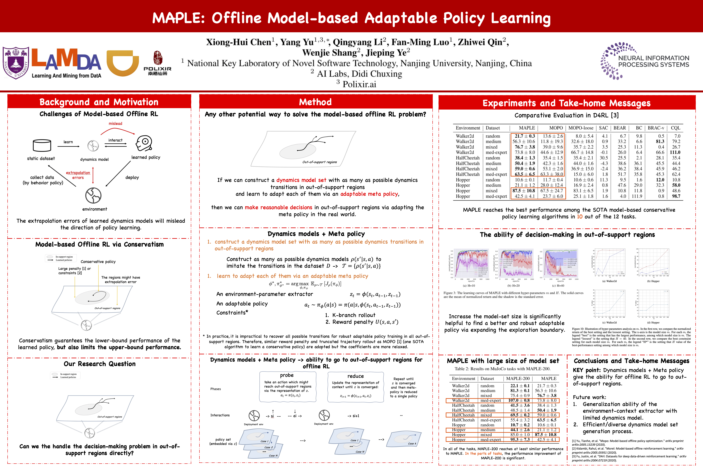
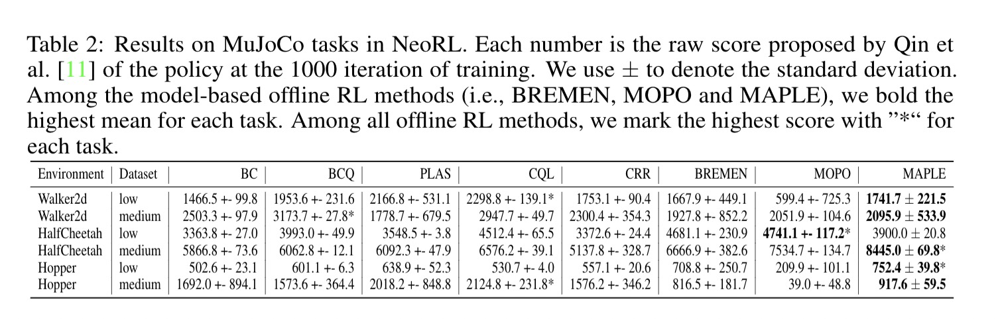
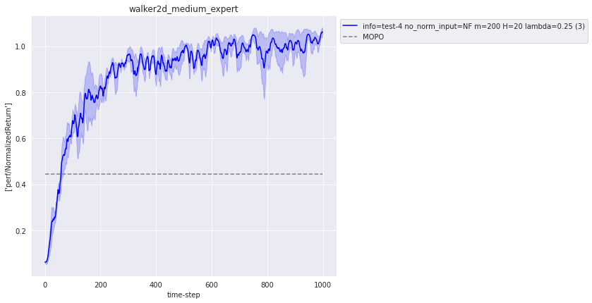

# MAPLE
The Official Code for  "[MAPLE: Offline Model-based Adaptable Policy Learning](https://proceedings.neurips.cc/paper/2021/hash/470e7a4f017a5476afb7eeb3f8b96f9b-Abstract.html)". 

After being accepted in NeurIPS'21, we conducted experiments in [NeoRL](https://arxiv.org/abs/2102.00714). The results can be found in the following table.

\* In this process, we introduced parts of implementation tricks in [the NeoRL version of MOPO](https://agit.ai/Polixir/OfflineRL/src/branch/master/offlinerl) into MAPLE, which also make the training process of MAPLE more stable in NeoRL tasks and keep (or further improve) the performance in D4RL.

(The Pytorch version of MAPLE can also be found in: https://agit.ai/Polixir/OfflineRL)

# [optional] Download Resources

For better reproducibility, we uploaded a backup of dataset which is used in our experiment, since we found that the content of dataset in [D4RL](https://github.com/rail-berkeley/d4rl) and [NeoRL](https://github.com/polixir/NeoRL) might be changed.   
- D4RL: https://drive.google.com/drive/folders/1kgNg6xLHRTyb_tzDQULezB9XYGNuakCM?usp=sharing
- NeoRL: https://drive.google.com/drive/folders/1gZdVQTY_7FLCFGqszHF9sfKcXT8epoze?usp=sharing

After downloaded, you can push the data of D4RL to ~/.d4rl/datasets and NeoRL to {your path to MAPLE}/neorl_data/

We have also uploaded the dynamics models for MAPLE-200 and MAPLE-NeoRL (which have 50 ensemble models) training, which can be found in: https://drive.google.com/drive/folders/1Ex9_RyJsafKaU2Eo5UgD34ZqJnJ25cru?usp=sharing.
You can download the models to {path to MAPLE}/models to skip the dynamics model training process. 

# Installation

We use [RLAssistant](https://github.com/xionghuichen/RLAssistant) to manage our experiments. You can download and install it via:
```
git clone https://github.com/xionghuichen/RLAssistant.git
cd RLAssistant
pip install -e .
```
Then you can install MAPLE via:
```
git clone https://github.com/xionghuichen/MAPLE.git
cd MAPLE
pip install -e .
```

# Quick Start

You can train your MAPLE policy directly like this:
```
cd run_scripts
# train the MAPLE policy for the hopper_low task in neorl
python main.py --config examples.config.neorl.hopper_low
or 

# train the MAPLE policy for walker2d_medium_expert task in d4rl
python main.py --config examples.config.d4rl.walker2d_medium_expert 

# train the MAPLE policy for walker2d_medium_expert task in d4rl with 200 dynamics models
python main.py --config examples.config.d4rl.walker2d_medium_expert --maple_200


# train the MAPLE policy for walker2d_medium_expert task in d4rl with your custom configs
python main.py --config examples.config.d4rl.walker2d_medium_expert --custom_config --penalty_coeff 1.0
```

The training logs can be found in {your MAPLE path}/log. You can use tensorbard to check and also use the tools in RLA to visualize (e.g., ```RLA.easy_plot.plot_func.plot_res_func```).
You can check plot_demo.ipynb for more details. The figure of the simplest setting will be something like this:



There are also some scrips in ``./rla_scrips`` to manage the experimental logs. 
